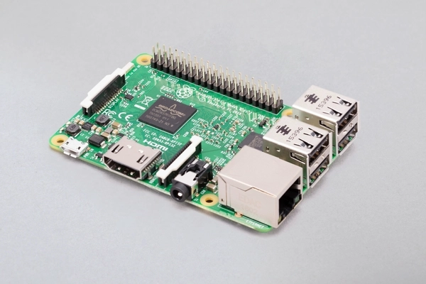

# 树莓派上手
## 树莓派是什么？  
树莓派是一款SOC核心板，包含有常见的接口（网口，USB，hdmi，CSI，GPIO，3.5mm音频输出，蓝牙，WIFI等）  
一般情况下，你可以认为它是一台小型电脑，可以独立作为主机运行，在TF卡系统镜像的加持下，你可以通过接口连接常见的外设进行操作和使用  
## 能干什么？
由于树莓派上运行了Linux操作系统，配合接口可以完成许多功能，这里简单列举一下：
1. 作为主控，通过硬件总线（SPI,IIC,UART,GPIO）控制底层外设，也可以在配合屏幕进行交互。数据采集，过程控制，图像识别
2. 作为服务器搭建网页，FTP，NAS等网络应用
3. 制作智能音响
4. 制作游戏机
5. 制作电视盒子
6. 代替电脑
## 树莓派家族介绍
* Raspberry Pi Zero
  
* Raspberry Pi Zero W
  
* Raspberry Pi 1 Model A+
  
* Raspberry Pi 1 Model B+
  
* Raspberry Pi 2 Model B
  
* Raspberry Pi 3 Model B
  
* Raspberry Pi 3 Model B+
  
* Raspberry Pi 3 Model A+
  
* Raspberry Pi 4 Model B
  
* Raspberry Pi 400
  
* Raspberry Pi Pico
  
## 树莓派如何上手

### 怎么开始？
* Step1:烧写镜像  
* Step2:插上外设&电源
* Step3:等待开机  
  
以下首先以官方镜像作为说明

1. 烧写镜像   
   这个操作被官方做的越来越简单了
   * 以前：下载镜像，然后通过各种软件将镜像烧写入SD/TF卡
   * 现在：安装官方软件，选择烧入的镜像，选择SD/TF卡，开始烧写，一站式搞定（需要联网，在线下载镜像，经过我的尝试，emmmm，似乎有点慢）  

   镜像介绍：
   * FULL 除镜像外还包含必要的软件
   * LITE 仅镜像，且不带桌面
   * General  

   点击[下载链接](https://www.raspberrypi.org/software/operating-systems/)  
     
   镜像分为三个版本
    * 第一个包含必要的软件和桌面（类似windows的界面）
    * 第二个包含桌面
    * 第三个为精简版系统，没有桌面，只有命令行 

   烧写工具（Windows平台）：
   * [balenaEtcher](https://www.balena.io/etcher/)
   * [Win32 Disk Imager](https://sourceforge.net/projects/win32diskimager/)
   * [Upswift imgFlasher](https://www.upswift.io/imgflasher)

   > https://www.raspberrypi.org/documentation/installation/installing-images/README.md 
2. 插入外设
   1. SD/TF卡
   2. 键盘
   3. 鼠标
   4. 显示器(Raspberry Pi 4B的hdmi接口为micro hdmi，需要转接线)
   5. 网络（有线网络或者进入系统后连接无线网络）
   6. 电源（Raspberry Pi 4B为usb type-c接口，5V/3A, Raspberry Pi 3B）
   > https://www.raspberrypi.org/documentation/setup/
3. 开机

### 用python编写代码

### 用C语言编写代码

### 有用的tips

#### 远程连接
> https://www.raspberrypi.org/documentation/remote-access/
#### GPIO
> https://www.raspberrypi.org/documentation/usage/gpio/

> https://projects.raspberrypi.org/en/projects/raspberry-pi-setting-up