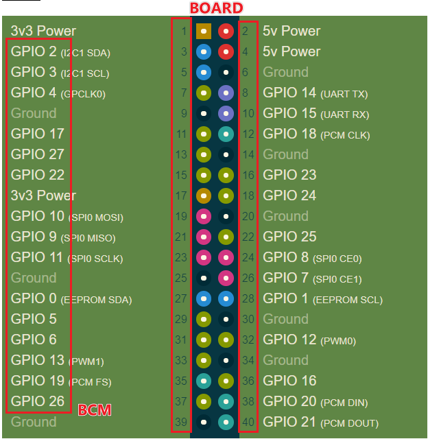

# GPIO
```
sudo apt-get install raspi-gpio
raspi-gpio funcs
```
## gpiozero
应用层的GPIO封装，省去了基本的IO操作，可以直接将IO设置成LED，Button等对象  
包含了这些对象的常用动作（如LED闪烁，按键按下等）
### LED
* on()
* off()
* toggle()
* blink()
``` python
from gpiozero import LED
from time import sleep

led = LED(17)

while True:
    led.on()
    sleep(1)
    led.off()
    sleep(1)
```
### Button
* is_pressed
* is_held
* when_pressed
* when_released
* when_held 
* wait_for_press() 
* wait_for_release()
``` python
from gpiozero import Button
from time import sleep

button = Button(2)

while True:
    if button.is_pressed:
        print("Pressed")
    else:
        print("Released")
    sleep(1)
```
> https://gpiozero.readthedocs.io/en/stable/index.html  

## RPi.GPIO  
传统的树莓派GPIO控制库，更偏向于C  
* 确定引脚编号
* 设置输入输出
* 设置/读取电平

``` python
import RPi.GPIO as GPIO

GPIO.setmode(GPIO.BOARD) #GPIO.setmode(GPIO.BCM)
GPIO.setup(12,GPIO.IN)
GPIO.setup(13,GPIO.OUT)

chan_list = [10,11] #or chan_list = (10,11)
GPIO.setup(chan_list,GPIO.OUT)

print(GPIO.input(12))

GPIO.output(13,GPIO.LOW) # or 0 or False
GPIO.output(chan_list,(GPIO.HIGH,GPIO.LOW))

pwm_pin=20
frequency=1000
duty=20 # %
p = GPIO.PWM(pwm_pin, frequency)

p.start(duty)

freq=2000
p.ChangeFrequency(freq)
duty=30
p.ChangeDutyCycle(duty)

p.stop()

GPIO.cleanup()
```
### BCM vs BOARD
模式设置（GPIO.setmode）用于确定引脚编号方式  
在树莓派中有两种不同的引脚编号方式：
1. BOARD number: 树莓派P1 2x20排针的顺序 
2. BCM number: Broadcom SOC的引脚编号，例如GPIO x


### 边沿检测
?是否需要首先设置为输入？
wait_for_edge()  
event_detected()  
``` python
import RPi.GPIO as GPIO
GPIO.setmode(GPIO.BOARD)

# wait for up to 5 seconds for a rising edge (timeout is in milliseconds)
channel = GPIO.wait_for_edge(channel, GPIO_RISING, timeout=5000)
if channel is None:
    print('Timeout occurred')
else:
    print('Edge detected on channel', channel)

GPIO.add_event_detect(channel, GPIO.RISING)  # add rising edge detection on a channel GPIO.RISING, GPIO.FALLING or GPIO.BOTH
do_something()
if GPIO.event_detected(channel):
    print('Button pressed')
```
### 多线程回调函数
* GPIO.add_event_callback(channel,my_callbackfunction)
* GPIO.add_enent_detect(channel, GPIO.RISING, callback=my_callbackfunction)
``` python
def my_callback(channel):
    print('This is a edge event callback function!')
    print('Edge detected on channel %s'%channel)
    print('This is run in a different thread to your main program')

GPIO.add_event_detect(channel, GPIO.RISING, callback=my_callback)  # add rising edge detection on a channel
```
``` python
def my_callback_one(channel):
    print('Callback one')

def my_callback_two(channel):
    print('Callback two')

GPIO.add_event_detect(channel, GPIO.RISING)
GPIO.add_event_callback(channel, my_callback_one)
GPIO.add_event_callback(channel, my_callback_two)
```
消抖处理  
* GPIO.add_event_detect(channel, my_callbackfunction,bouncetime=200) #in ms
* GPIO.add_event_callback(channel,my_callbackfunction, bouncetime=200)

删除事件
* GPIO.remove_event_detect(channel)

> https://sourceforge.net/p/raspberry-gpio-python/wiki/Home/  
> https://pypi.org/project/RPi.GPIO/  

> https://www.raspberrypi.org/documentation/usage/gpio/python/README.md  
# SPI

Speed: supports all speeds, but due to limit of GPIO, over 50Mhz is unlikely to work
Mode
  * SPI_CPOL
  * SPI_CPHA
  * SPI_CS_HIGH
  * SPI_NO_CS
  * SPI_3WIRE

> https://www.raspberrypi.org/forums/viewtopic.php?f=44&t=43442&p=347073
## spidev
spidev like s shell 
``` bash
echo -ne "\x01\x02\x03" > /dev/spidev0.0
```
``` python
import spidev
spi = spidev.SpiDev()
spi.open(bus,device)    # /dev/spidev<bus>.<device>

# Settings
spi.max_speed_hz=5000
spi.mode = 0b01         # [CPOL|CPHA] 
spi.bits_per_word = 8   # 8 :normal 9:LoSSI
spi.cshigh = False
spi.loop = False
spi.no_cs = False
spi.lsbfirst = True
spi.threewire = False
# send/receive
to_send=[0x01,0x02,0x03]

spi.readbytes(n)
spi.writebytes(to_send)
spi.writebytes2(to_send) # large lists, like list size seceeds buffer size /sys/module/spidev/parameters/bufsiz

# list,speed_hz,delay_usec,bits_per_word
spi.xfer(to_send,5000,1,8)      # cs will released and reactivated between blocks, delay in delay_usec
spi.xfer2(to_send,5000,1,8)     # cs held between two block
spi.xfer3(to_send,5000,1,8)     # similar xfer2, large lists

spi.close()
```

> https://pypi.org/project/spidev/
## SPI-Sy

``` python
import spi
device_0 = spi.openSPI(device='/dev/spidev0.0',mode=0.speed=500000,bits=8;delay=0)
data_out = (0xFF,0x00,0xFF)
data_in = spi.transfer(device_0,data_out)
spi.closeSPI(device_0)
```
> https://github.com/lthiery/SPI-Py

## Test Mode
Loopback test

> https://www.raspberrypi.org/documentation/hardware/raspberrypi/spi/README.md  
> https://elinux.org/RPi_SPI
# UART
前几代树莓派中有2个内建串口（Pi 4 中有6个）：
1. PL011 UART
2. mini UART
根据型号他们的连接越有不同，详见以下表格：
|Model  |First PL011(UART0)     |mini UART  |
|:--:   |:---:                  |:--:       |
|Zero   |primary                |secondary  |
|Zero W |secondary(Bluetooth)   |primary    |
|Pi 1   |primary                |secondary  |
|Pi 2   |primary                |secondary  |
|Pi 3   |secondary(Bluetooth)   |primary    |
|Pi 4   |secondary(Bluetooth)   |primary    |
mini UART默认是不开启的，UART0默认是开启的  
在Raspberry Pi OS系统中，他们对应的设备文件如下所示：
|Linux Device   |    Description    |
|:--:           |:---:              |
|/dev/ttys0     |mini UART          |
|/dev/ttyAMA0   |First PL011(UART0) |
|/dev/serial0   |primary UART       |
|/dev/serial1   |secondary UART     |
可以通过以下命令可以查看串口的映射关系
``` bash
ls -l /dev
```
串口是linux中常见的外设类型，常用于输出控制台（console）信息。树莓派可以通过配置，将UART使能，但不用于控制台信息的输入输出，自定义串口的收发信息  
## Raspberry Pi 4 串口的启用和引脚
|UART   |GPIO   |
|:-----:|:-----:|
|0      |14/15  |
|1      |14/15  |
|2      |0/1    |
|3      |4/5    |
|4      |8/9    |
|5      |12/13  |
```
/boot/config.txt.
/boot/overlays/README
```
> https://raspberrypi.stackexchange.com/questions/104464/where-are-the-uarts-on-the-raspberry-pi-4  
> https://www.raspberrypi.org/forums/viewtopic.php?t=244827
## 关闭linux串口控制台输出
``` bash
sudo raspi-config
```
* option3-Interface Options
* P6 Seral Port
* No
* Yes
* reboot pi
## PySerial
``` python
import serial
ser = serial.Serial('/dev/ttys0',9600,EIGHYBITS,parity=PARITY_NONE,stopbits=STOPBITS_ONE,timeout=None)
ser.Baudtate=115200
received_data = ser.read(1)
ser.write(received_data)
```
> https://pyserial.readthedocs.io/en/latest/shortintro.html  

> https://www.raspberrypi.org/documentation/configuration/uart.md  

# IIC

# 
